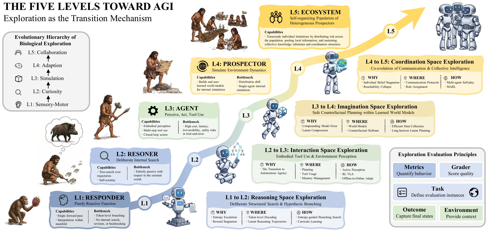
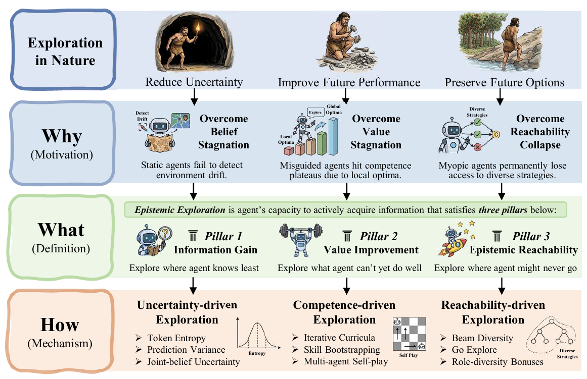
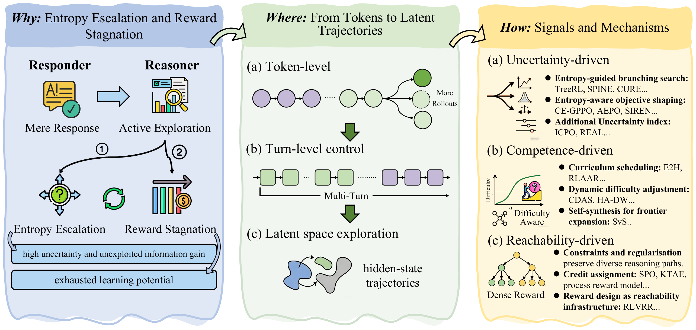
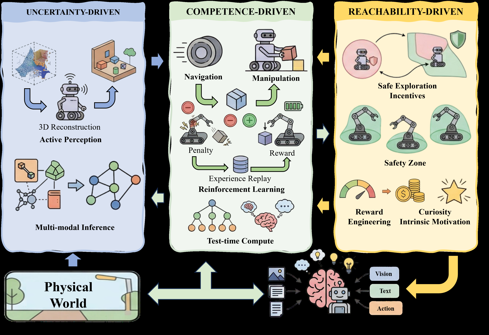
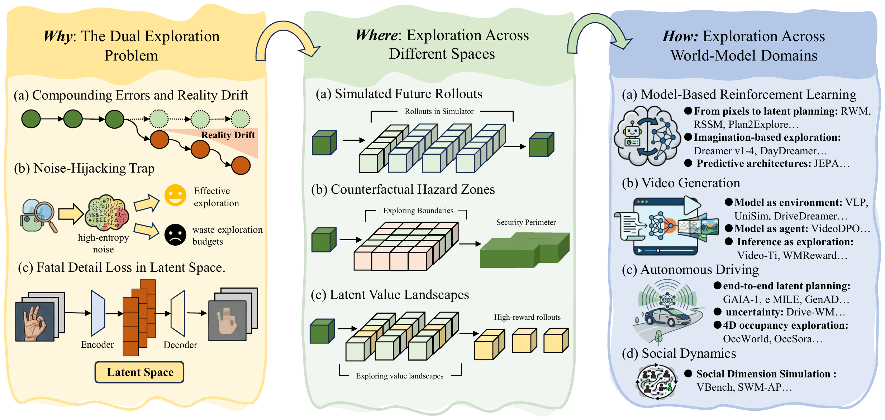
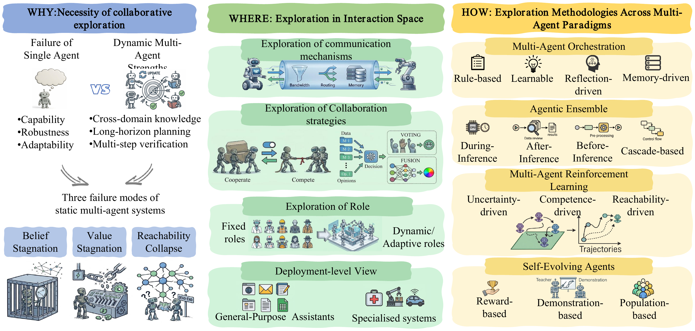

# 🔥 Epistemic Exploration Toward Artificial General Intelligence

<p align="center">
  <b>"Epistemic Exploration Toward Artificial General Intelligence"</b>
  <br>
  <i>ArXiv 2026</i>
  <br><br>
  <b>◇ Responder → Reasoner → Agent → Prospector → Ecosystem ◇</b>
  <br>
  <i>Exploration as the Transition Mechanism</i>
</p>

<p align="center"></p>

<p align="center">
  <!-- <a href="#"></a> -->
  <!-- <a href="#"></a> -->
  <a href="https://github.com/banyikun/epistemic_exploration"></a>
  <a href="#"></a>
  <a href="#"></a>
  <a href="#"></a>
</p>

<p align="center">
  <a href="https://github.com/banyikun/epistemic_exploration/stargazers"></a>
  <a href="https://github.com/banyikun/epistemic_exploration/network/members"></a>
</p>

> **If you find our survey helpful, please give it a ⭐ star to show your support! Thank you :)**

---

## 📣 Notices

> 🔥 This is a curated paper list for the survey **"Epistemic Exploration Toward Artificial General Intelligence"**, covering exploration mechanisms across reasoning, embodied AI, world models, and multi-agent systems.

> 🔥 **[Stay tuned for our full paper release, incorporating the latest developments.]**

> **[Always] [Add your papers]** We welcome all related papers! If you find any missed or new work, please open a Pull Request or contact us.

> **[Always] [Maintain]** We will keep this list updated frequently!

---

## 📑 Table of Contents

- [1. Overview](#1-overview)
  - [1.1 What is Epistemic Exploration?](#11-what-is-epistemic-exploration)
  - [1.2 Three Criteria](#12-three-criteria)
  - [1.3 Five-Level Trajectory Toward AGI](#13-five-level-trajectory-toward-agi)
  - [1.4 3×5 Taxonomy](#14-3×5-taxonomy)
- [2. Level 1–2: Responder → Reasoner (Reasoning-Space Exploration)](#2-levels-12-responder--reasoner--reasoning-space-exploration)
  - [2.1 Uncertainty-Driven Exploration](#21-uncertainty-driven-exploration)
  - [2.2 Competence-Driven Exploration](#22-competence-driven-exploration)
  - [2.3 Reachability-Driven Exploration](#23-reachability-driven-exploration)
- [3. Level 3: Reasoner → Agent (Perception- & Action-Space Exploration)](#3-level-3-reasoner--agent--perception--action-space-exploration)
  - [3.1 Digital Agents](#31-digital-agents)
  - [3.2 Embodied Agents](#32-embodied-agents)
- [4. Level 4: Agent → Prospector (Imagination-Space Exploration)](#4-level-4-agent--prospector--imagination-space-exploration)
- [5. Level 5: Prospector → Ecosystem (Coordination-Space Exploration)](#5-level-5-prospector--ecosystem--coordination-space-exploration)
- [6. Cross-Cutting Topics](#6-cross-cutting-topics)
- [7. Citation](#7-citation)

---

## 1. Overview

### 1.1 What is Epistemic Exploration?

> **Epistemic exploration** is the agent's capacity to actively acquire information that reduces its uncertainty about the world, convert that reduction into durable policy improvement, and keep future acquisition possible.

Unlike undirected exploration (e.g., ε-greedy), epistemic exploration is *intentional*, *belief-driven*, and *multi-scale*: the agent reasons about which actions are most informative and plans multi-step information-gathering strategies across reasoning trajectories, tool-use policies, embodied sensorimotor loops, world-model rollouts, and multi-agent coordination protocols.

### 1.2 Three Criteria

<p align="center"></p>
<p align="center"><i>Figure: Foundation of Epistemic Exploration — Why, What, and How.</i></p>

We ground epistemic exploration in **three jointly necessary criteria**, each addressing a distinct failure mode of static optimisation:

| Criterion | What It Does | Failure Mode Addressed | Explores... |
|:---------:|:-------------|:-----------------------|:------------|
| **C1: Information Gain** | Actively reduces epistemic uncertainty via belief-updating observations | *Belief Stagnation* — frozen internal model under distribution shift | ...where it knows least |
| **C2: Value Improvement** | Converts new information into durable policy improvement | *Value Stagnation* — local optima lock-in, surrogate misalignment | ...what it cannot yet do well |
| **C3: Epistemic Reachability** | Preserves positive visitation over belief-consistent regions | *Reachability Collapse* — irreversible contraction of behavioural diversity | ...where it might otherwise never go |

These form a closed loop: **gain information → convert to value → keep the capacity to gain information alive → ...**

### 1.3 Five-Level Trajectory Toward AGI

We propose exploration as the **transition mechanism** between five levels of increasing agent sophistication. Each level introduces a qualitatively new exploration space that the previous level cannot access:

| Transition | Exploration Space | What Becomes Explorable |
|:-----------|:------------------|:------------------------|
| **L1→L2: Responder → Reasoner** | **Reasoning space** | Hypotheses, reasoning trajectories, latent thought representations |
| **L2→L3: Reasoner → Agent** | **Perception & action space** | Tool invocation, sensorimotor loops, memory management |
| **L3→L4: Agent → Prospector** | **Imagination space** | Counterfactual futures in learned world models, dual real-imagined exploration |
| **L4→L5: Prospector → Ecosystem** | **Coordination space** | Communication topologies, role assignments, shared world models |

### 1.4 3×5 Taxonomy

Our survey is organized as a **3×5 taxonomy** crossing three signal-driven methodologies with the five levels:

|  | **L1 Responder** | **L2 Reasoner** | **L3 Agent** | **L4 Prospector** | **L5 Ecosystem** |
|:-|:---|:---|:---|:---|:---|
| **Uncertainty-Driven** | Token entropy | Ensemble disagreement, semantic uncertainty | Active SLAM, prediction variance | Epistemic disagreement in latent space | Joint-belief uncertainty |
| **Competence-Driven** | Input difficulty | Iterative curricula, self-play | Skill bootstrapping, RL-VLA | Imagination-based skill discovery | Multi-agent self-play curricula |
| **Reachability-Driven** | Anti-repetition | Beam diversity, reasoning-path anti-foreclosure | Go-Explore, coverage curricula | Latent-space diversity bonuses | Role-diversity, anti-specialisation |

---

## 2. Levels 1–2: Responder → Reasoner — Reasoning-Space Exploration

The transition from **Responder** to **Reasoner** requires exploration in *reasoning space*: branching over token sequences, reasoning trajectories, and latent thought representations. The agent must search for informative hypotheses rather than simply produce reactive outputs.

<p align="center"></p>
<p align="center"><i>Figure: Levels 1–2 Reasoning-Space Exploration — Why (entropy escalation & reward stagnation), Where (tokens → turns → latent trajectories), and How (uncertainty / competence / reachability-driven).</i></p>

### 2.1 Uncertainty-Driven Exploration

Methods that prioritise exploration at high-uncertainty branching points in the reasoning process:

| Method | Strategy | Paper |
|:-------|:---------|:------|
| **CURE** | High-entropy tokens as re-branching anchors | Uncertainty-aware Reasoning Enhancement (2025) |
| **SPINE** | Concentrates updates on high-entropy branching points | Sparse Inference with Entropy (2025) |
| **TreeRL** | On-policy tree search from high-entropy steps | Tree-Structured RL for Reasoning (2025) |
| **CE-GPPO** | Coordinating entropy-gradient preservation | CE-GPPO (2025) |
| **SIREN** | Top-p & peak-entropy masks for meaningful exploration | Rethinking Entropy in LLM Reasoning (2025) |
| **AEPO** | Anchors entropy to user-specified target level | Arbitrary Entropy Policy Optimization (2025) |
| **ICPO** | Intrinsic confidence from relative generation probabilities | Intrinsic Confidence Policy Optimization (2025) |
| **REAL** | Categorical labels replacing scalar rewards | Rewards as Labels (2026) |

### 2.2 Competence-Driven Exploration

Methods that match problem difficulty to the model's evolving competence frontier:

| Method | Strategy | Paper |
|:-------|:---------|:------|
| **E2H** | Easy-to-hard curriculum with gradual fade-out | Easy to Hard Curriculum (2025) |
| **RLAAR** | Ability-gated curriculum with abstention reward | RL with Abstention-Aware Rewards (2025) |
| **Online Difficulty Filtering** | Selects medium-difficulty samples by current success rate | Dynamic Difficulty Filtering (2025) |
| **CDAS** | Historical performance gaps for robust difficulty estimation | Competence-Driven Adaptive Sampling (2025) |
| **HA-DW** | Tracks evolving competence, reweights difficulty | Hardness-Aware Dynamic Weighting (2026) |
| **SvS** | Self-synthesized harder variants from solved examples | Solve via Self-play (2025) |
| **Absolute Zero** | Reinforced self-play with zero external data | Absolute Zero Reasoner (2025) |

### 2.3 Reachability-Driven Exploration

Methods that prevent irreversible contraction of reasoning trajectory distributions:

| Method | Strategy | Paper |
|:-------|:---------|:------|
| **Trust-region methods** | KL penalties, PPO clipping to preserve pre-trained breadth | Various (2025) |
| **Anti-degeneration penalties** | Repetition penalties, length-budget constraints | Welleck et al. (2020), various (2025) |
| **SPO / KTAE** | Step-level credit assignment preserving alternative trajectories | Step Policy Optimization / KTAE (2025) |
| **VRPRM** | Process-level dense supervision for intermediate steps | Verifiable Reward PRM (2025) |
| **RLVRR** | Content coverage + style constraints for denser rewards | RL with Verifiable & Reward-Rich feedback (2026) |

---

## 3. Level 3: Reasoner → Agent — Perception- & Action-Space Exploration

At Level 3, the agent crosses from internal reasoning into **situated interaction with external environments**. Exploration unfolds in perception and action space, where every step incurs real cost.

### 3.1 Digital Agents

Agents operating in software-mediated environments (web, APIs, code interpreters):

| Paradigm | Method | Key Idea |
|:---------|:-------|:---------|
| **Uncertainty-Driven** | JitRL | Count-based exploration bonus for unseen state-action pairs |
| | Agent Q | MCTS with UCB for strategic state exploration |
| | KnowSelf | Self-perceived capability boundaries trigger reflection |
| | Search-o1 | Invokes web search upon encountering unfamiliar knowledge |
| **Competence-Driven** | PilotRL | Three-stage progressive RL curriculum |
| | Planner-R1 | Dense process-level rewards as priors |
| | RLTR | Tool-use completeness rewards |
| | Agent0-VL | Self-Evolving Reasoning Cycle (SERC) |
| | Absolute Zero | Joint proposer-solver self-play |
| **Reachability-Driven** | EGPO | Entropy bonus in advantage over CoT tokens |
| | EPO | Three-part entropy control for multi-turn RL |
| | RAPO | Retrieval-augmented policy optimization |
| | E³-TIR | Expert-guided branching at high-entropy prefixes |

### 3.2 Embodied Agents

<p align="center"></p>
<p align="center"><i>Figure: Level 3 Embodied Agent Exploration — Uncertainty-driven active perception, competence-driven RL & test-time compute, and reachability-driven safety & reward engineering.</i></p>

Agents operating in physical/simulated environments with continuous action spaces:

| Paradigm | Method | Key Idea |
|:---------|:-------|:---------|
| **Uncertainty-Driven (Active Perception)** | ActiveSplat | Gaussian splatting for information-maximizing viewpoint selection |
| | Conan | Active reasoning in open-world environments |
| | ActiveRIR | Cross-modal audio-visual exploration |
| | Fisher-info path planning | Balances information gain with localization robustness |
| **Competence-Driven** | **Offline RL-VLA**: Q-Transformer, Cal-QL | Scale value learning to static trajectories |
| | **Online RL-VLA**: VLA-RL, FLaRe, SimpleVLA-RL | Real-time interactive policy exploration |
| | **Hybrid**: ConRFT, SRPO, Dual-Actor | Stable offline-to-online transitions |
| | **Test-Time**: VLA-Reasoner (MCTS), DeepThinkVLA, Hume | Imagination before physical execution |
| | SayCan, Inner Monologue, LM-Nav | Language-guided objective-driven navigation |
| **Reachability-Driven** | Eureka | LLM-driven reward code synthesis |
| | Recovery RL, RECOVER, SafeVLA | Learned safety zones preserving reachable sets |
| | RND, CurricuLLM | Curiosity-driven and curriculum-based coverage |

---

## 4. Level 4: Agent → Prospector — Imagination-Space Exploration

<p align="center"></p>
<p align="center"><i>Figure: Level 4 Imagination-Space Exploration — Why (the dual exploration problem), Where (simulated rollouts, hazard zones, latent value landscapes), and How (MBRL, video generation, autonomous driving, social dynamics).</i></p>

The Prospector internalises a **world model** and faces a **dual exploration problem**: simultaneously gathering real data to refine the model AND searching imagined trajectories to extract policies.
The Prospector internalises a **world model** and faces a **dual exploration problem**: simultaneously gathering real data to refine the model AND searching imagined trajectories to extract policies.


### 4.1 Surveys & Overviews

- **A survey of monte carlo tree search methods** (2012) 

- **Survey of model-based reinforcement learning: Applications on robotics** (2017) 

- **A survey of learning in multiagent environments: Dealing with non-stationarity** (2017) <a href="https://arxiv.org/abs/1707.09183"></a>

- **Model-based reinforcement learning: A survey** (2023) 

- **An Information-Theoretic Perspective on Intrinsic Motivation in Reinforcement Learning: A Survey** (2023) 

- **A Survey on Model-based Reinforcement Learning** (2024) <a href="https://arxiv.org/abs/2206.09328"></a>

- **A survey of world models for autonomous driving** (2025) <a href="https://arxiv.org/abs/2501.11260"></a>

- **A Survey of Embodied World Models** (2025) 

- **Reward Models in Deep Reinforcement Learning: A Survey** (2025) 

- **A Survey of Safe Reinforcement Learning and Constrained MDPs: A Technical Survey on Single-Agent and Multi-Agent Safety** (2025) <a href="https://arxiv.org/abs/2505.17342"></a>

- **A Comprehensive Survey on Physical Risk Control in the Era of Foundation Model-enabled Robotics** (2025) 

- **The role of world models in shaping autonomous driving: A comprehensive survey** (2026) <a href="https://arxiv.org/abs/2502.10498"></a>

- **Latent World Models for Automated Driving: A Unified Taxonomy, Evaluation Framework, and Open Challenges** (2026) <a href="https://arxiv.org/abs/2603.09086"></a>

- **Towards Generalist Embodied AI: A Survey on World Models for VLA Agents** (2026) 


### 4.2 Foundations & Classic MBRL

- **Adaptive confidence bounds for exploration--exploitation trade-offs** (1991) 

- **What uncertainties do we need in bayesian deep learning for computer vision?** (2017) 

- **Recurrent world models facilitate policy evolution** (2018) 

- **World Models** (2018) 

- **When to Trust Your Model: Model-Based Policy Optimization** (2019) <a href="https://arxiv.org/abs/1906.08253"></a>

- **Learning to poke by poking: Experiential learning of intuitive physics** (2019) 

- **Mastering atari with discrete world models** (2020) <a href="https://arxiv.org/abs/2010.02193"></a>

- **Planning to Explore via Self-Supervised World Models** (2020) <a href="https://arxiv.org/abs/2005.05960"></a>

- **A Generalist Agent** (2022) <a href="https://arxiv.org/abs/2205.06175"></a>

- **Model-Based Imitation Learning for Urban Driving** (2022) 

- **Language models represent space and time** (2023) <a href="https://arxiv.org/abs/2310.02207"></a>

- **Geollm: Extracting geospatial knowledge from large language models** (2023) <a href="https://arxiv.org/abs/2310.06213"></a>

- **Leveraging pre-trained large language models to construct and utilize world models for model-based task planning** (2023) 

- **Self-supervised learning from images with a joint-embedding predictive architecture** (2023) 

- **Language models meet world models: Embodied experiences enhance language models** (2023) 

- **Uncertainty-Aware Model-Based Offline Reinforcement Learning for Automated Driving** (2023) 

- **Driving into the Future: Multiview Visual Forecasting and Planning** (2024) 

- **Revisiting feature prediction for learning visual representations from video** (2024) <a href="https://arxiv.org/abs/2404.08471"></a>

- **Learning and leveraging world models in visual representation learning** (2024) <a href="https://arxiv.org/abs/2403.00504"></a>

- **Efficient and scalable reinforcement learning for large-scale network control** (2024) 

- **Training agents inside of scalable world models** (2025) <a href="https://arxiv.org/abs/2509.24527"></a>

- **Thinking in space: How multimodal large language models see, remember, and recall spaces** (2025) 

- **Smart Exploration in Reinforcement Learning using Bounded Uncertainty Models** (2026) <a href="https://arxiv.org/abs/2504.05978"></a>

- **MEM: Multi-Scale Embodied Memory for Vision Language Action Models** (2026) <a href="https://arxiv.org/abs/2603.03596"></a>


### 4.3 Dreamer Family (Latent World Models)

- **Dream to control: Learning behaviors by latent imagination** (2019) <a href="https://arxiv.org/abs/1912.01603"></a>

- **Learning latent dynamics for planning from pixels** (2019) 

- **Planet: Model-based reinforcement learning for multi-goal visual control** (2020) 

- **Daydreamer: World models for physical robot learning** (2023) 

- **DreamerV3: Mastering Diverse Domains through World Models** (2023) 

- **DriveDreamer: Towards Real-World-Driven World Models for Autonomous Driving** (2024) 

- **DriveDreamer-2: LLM-enhanced world models for diverse driving video generation** (2025) 


### 4.4 Uncertainty-Driven Exploration in World Models

- **Model-based active exploration** (2019) <a href="https://arxiv.org/abs/1810.12162"></a>

- **RIDE: Rewarding Impact-Driven Exploration for Procedurally-Generated Environments** (2020) <a href="https://arxiv.org/abs/2002.12292"></a>

- **Curiosity in Hindsight: Intrinsic Exploration in Stochastic Environments** (2022) <a href="https://arxiv.org/abs/2211.10515"></a>

- **Information-theoretic model selection for optimal prediction** (2023) 

- **Active Exploration in Bayesian Model-based Reinforcement Learning for Robot Manipulation** (2024) <a href="https://arxiv.org/abs/2404.01867"></a>

- **World Model Robustness via Surprise Recognition** (2025) <a href="https://arxiv.org/abs/2512.01119"></a>

- **Beyond Noisy-TVs: Noise-Robust Exploration Via Learning Progress Monitoring** (2025) <a href="https://arxiv.org/abs/2509.25438"></a>

- **Curiosity-Driven Imagination: Discovering Plan Operators and Learning Associated Policies for Open-World Adaptation** (2025) <a href="https://arxiv.org/abs/2503.04931"></a>

- **The Impact of Intrinsic Rewards on Exploration in Reinforcement Learning** (2025) 

- **Latent Reasoning in LLMs as a Vocabulary-Space Superposition** (2025) <a href="https://arxiv.org/abs/2510.15522"></a>

- **Exploring Representation-Aligned Latent Space for Better Generation** (2025) <a href="https://arxiv.org/abs/2502.00359"></a>

- **ActSafe: Active Exploration with Safety Constraints for Reinforcement Learning** (2025) <a href="https://arxiv.org/abs/2410.09486"></a>

- **General Exploratory Bonus for Optimistic Exploration in RLHF** (2025) <a href="https://arxiv.org/abs/2510.03269"></a>

- **Information-Theoretic Intrinsic Motivation for Reinforcement Learning in Combinatorial Routing** (2026) 

- **SuS: Strategy-aware Surprise for Intrinsic Exploration** (2026) <a href="https://arxiv.org/abs/2601.10349"></a>


### 4.5 Competence-Driven MBRL & Safe Exploration

- **Dyna, an integrated architecture for learning, planning, and reacting** (1991) 

- **Efficient Exploration In Reinforcement Learning** (1992) 

- **Prediction, learning, and games** (2006) 

- **PILCO: A model-based and data-efficient approach to policy search** (2011) 

- **Model-Based Reinforcement Learning with Adversarial Training** (2014) 

- **Model regularization for stable sample rollouts** (2014) 

- **Deep exploration via bootstrapped DQN** (2016) 

- **Learning and policy search in stochastic dynamical systems with bayesian neural networks** (2016) <a href="https://arxiv.org/abs/1605.07127"></a>

- **Mastering the game of Go with deep neural networks and tree search** (2016) 

- **Mastering chess and shogi by self-play with a general reinforcement learning algorithm** (2017) <a href="https://arxiv.org/abs/1712.01815"></a>

- **Prediction and control with temporal segment models** (2017) 

- **Algorithmic framework for model-based deep reinforcement learning with theoretical guarantees** (2018) <a href="https://arxiv.org/abs/1807.03858"></a>

- **Sample-Efficient Reinforcement Learning with Stochastic Ensemble Value Expansion** (2018) <a href="https://arxiv.org/abs/1807.01675"></a>

- **Lipschitz Continuity in Model-based Reinforcement Learning** (2018) <a href="https://arxiv.org/abs/1804.07193"></a>

- **Deep Reinforcement Learning in a Handful of Trials using Probabilistic Dynamics Models** (2018) <a href="https://arxiv.org/abs/1805.12114"></a>

- **Model-ensemble trust-region policy optimization** (2018) <a href="https://arxiv.org/abs/1802.10592"></a>

- **Convergence of learning dynamics in stackelberg games** (2019) <a href="https://arxiv.org/abs/1906.01217"></a>

- **A game theoretic framework for model based reinforcement learning** (2020) 

- **Stochastic latent actor-critic: Deep reinforcement learning with a latent variable model** (2020) 

- **Offline reinforcement learning as one big sequence modeling problem** (2021) 

- **Model-based reinforcement learning with multi-hop reasoning** (2023) <a href="https://arxiv.org/abs/2309.12412"></a>

- **Differentiable Information Enhanced Model-Based Reinforcement Learning** (2025) 

- **Long-Horizon Model-Based Offline Reinforcement Learning Without Conservatism** (2025) <a href="https://arxiv.org/abs/2512.04341"></a>

- **A Unified Uncertainty-Aware Exploration: Combining Epistemic and Aleatory Uncertainty** (2025) 

- **Better World Models Can Lead to Better Post-Training Performance** (2025) <a href="https://arxiv.org/abs/2512.03400"></a>

- **The Reality Gap in Robotics: Challenges, Solutions, and Best Practices** (2025) <a href="https://arxiv.org/abs/2510.20808"></a>

- **Accelerating Model-Based Reinforcement Learning with State-Space World Models** (2025) <a href="https://arxiv.org/abs/2502.20168"></a>

- **Risk-Aware Reinforcement Learning with Dynamic Safety Filter for Collision Risk Mitigation in Mobile Robot Navigation** (2025) 

- **World model architectures in reinforcement learning: an exploration of strengths and limitations** (2025) 


### 4.6 Video Generation as World Models

- **Video Diffusion Models** (2022) 

- **Scalable Diffusion Models with Transformers** (2023) 

- **Video Generation Models as World Simulators** (2024) 

- **V-JEPA: Latent Video Prediction with Joint-Embedding Predictive Architecture** (2024) <a href="https://arxiv.org/abs/2404.08471"></a>

- **Genie: Generative Interactive Environments** (2024) 

- **VBench: Comprehensive Benchmark Suite for Video Generative Models** (2024) 

- **Worldgpt: Empowering llm as multimodal world model** (2024) 

- **V-jepa 2: Self-supervised video models enable understanding, prediction and planning** (2025) <a href="https://arxiv.org/abs/2506.09985"></a>

- **Huvidpo: Enhancing video generation through direct preference optimization for human-centric alignment** (2025) <a href="https://arxiv.org/abs/2502.01690"></a>

- **Video-t1: Test-time scaling for video generation** (2025) <a href="https://arxiv.org/abs/2503.18942"></a>

- **Videodpo: Omni-preference alignment for video diffusion generation** (2025) 

- **TAGRPO: Boosting GRPO on Image-to-Video Generation with Direct Trajectory Alignment** (2026) <a href="https://arxiv.org/abs/2601.05729"></a>

- **Inference-time Physics Alignment of Video Generative Models with Latent World Models** (2026) <a href="https://arxiv.org/abs/2601.10553"></a>


### 4.7 Autonomous Driving World Models

- **Recent development and applications of SUMO-Simulation of Urban MObility** (2012) 

- **CARLA: An Open Urban Driving Simulator** (2017) 

- **nuScenes: A Multimodal Dataset for Autonomous Driving** (2020) 

- **Scalability in Perception for Autonomous Driving: Waymo Open Dataset** (2020) 

- **FIERY: Future Instance Prediction in Bird's-Eye View from Surround Monocular Cameras** (2021) 

- **MILE: Model-Based Imitation Learning in Dot-Product Latent Spaces** (2022) 

- **Ego4D: Around the World in 3,000 Hours of Egocentric Video** (2022) 

- **GAIA-1: A Generative AI for Autonomous Driving** (2023) <a href="https://arxiv.org/abs/2309.17080"></a>

- **OccWorld: Learning a Visual World Model for Autonomous Driving** (2023) <a href="https://arxiv.org/abs/2311.16038"></a>

- **UniWorld: Autonomous Driving World Model as a Foundation Model** (2023) <a href="https://arxiv.org/abs/2308.01538"></a>

- **TrafficBots: Towards World Models for Autonomous Driving Simulation and Motion Prediction** (2023) 

- **Planning-oriented Autonomous Driving** (2023) 

- **UniSim: A neural closed-loop sensor simulator** (2023) 

- **OpenScene: The Largest Up-to-Date 3D Occupancy Prediction Benchmark in Autonomous Driving** (2023) 

- **Gaia-1: A generative world model for autonomous driving** (2023) <a href="https://arxiv.org/abs/2309.17080"></a>

- **BEVControl: Accurately controlling street-view elements with multi-perspective consistency via bev sketch layout** (2023) <a href="https://arxiv.org/abs/2308.01661"></a>

- **Language Conditioned Traffic Generation** (2023) 

- **Drive-WM: Multi-view World Model for Autonomous Driving** (2024) 

- **VAD-v2: End-to-End Vectorized Autonomous Driving via Probabilistic Planning** (2024) <a href="https://arxiv.org/abs/2402.13204"></a>

- **MagicDrive: Street View Generation with Diverse 3D Geometry Control** (2024) 

- **VADv2: End-to-End Vectorized Autonomous Driving via Probabilistic Planning** (2024) <a href="https://arxiv.org/abs/2402.13243"></a>

- **Copilot4D: Learning Unsupervised World Models for Autonomous Driving via Discrete Diffusion** (2024) 

- **SimGen: Simulator-conditioned Driving Scene Generation** (2024) 

- **Think2Drive: Efficient Reinforcement Learning by Thinking with Latent World Model for Autonomous Driving (in CARLA-V2)** (2024) 

- **DriveWorld: 4D Pre-trained Scene Understanding via World Models for Autonomous Driving** (2024) 

- **OccSora: 4D Occupancy Generation Models as World Simulators for Autonomous Driving** (2024) <a href="https://arxiv.org/abs/2405.20337"></a>

- **DrivingDiffusion: Layout-Guided Multi-view Driving Scenarios Video Generation with Latent Diffusion Model** (2024) 

- **DriveArena: A Closed-Loop Generative Simulation Platform for Autonomous Driving** (2024) <a href="https://arxiv.org/abs/2408.00415"></a>

- **UMAD: Unsupervised Mask-Level Anomaly Detection for Autonomous Driving** (2024) <a href="https://arxiv.org/abs/2406.06370"></a>

- **UniPAD: A universal pre-training paradigm for autonomous driving** (2024) 

- **DrivingWorld: Constructing World Model for Autonomous Driving via Video GPT** (2024) <a href="https://arxiv.org/abs/2412.19505"></a>

- **Vista: A Generalizable Driving World Model with High Fidelity and Versatile Controllability** (2024) 

- **Panacea: Panoramic driving scene generation with collaborative view diffusion** (2024) <a href="https://arxiv.org/abs/2404.12345"></a>

- **RealGen: Retrieval Augmented Generation for Controllable Traffic Scenarios** (2024) 

- **Delphi: Unleashing Generalization of End-to-End Autonomous Driving with Controllable Long Video Generation** (2024) <a href="https://arxiv.org/abs/2406.01349"></a>

- **LimSim++: A Closed-Loop Platform for Deploying Multimodal LLMs in Autonomous Driving** (2024) 

- **AD-L-JEPA: Self-Supervised Spatial World Models with Joint Embedding Predictive Architecture for Autonomous Driving with LiDAR Data** (2025) <a href="https://arxiv.org/abs/2501.04969"></a>

- **GenAD: Generative End-to-End Autonomous Driving** (2025) 

- **Driving in the Occupancy World: Vision-Centric 4D Occupancy Forecasting and Planning via World Models for Autonomous Driving** (2025) 

- **OccWorld: Learning a 3D Occupancy World Model for Autonomous Driving** (2025) 

- **DynamicCity: Large-Scale 4D Occupancy Generation from Dynamic Scenes** (2025) 

- **Gaussian World: Gaussian World Model for Streaming 3D Occupancy Prediction** (2025) 

- **DrivingSphere: Building a High-Fidelity 4D World for Closed-Loop Simulation** (2025) 

- **Raw2Drive: Reinforcement Learning with Aligned World Models for End-to-End Autonomous Driving (in CARLA-V2)** (2025) <a href="https://arxiv.org/abs/2505.16394"></a>

- **World4Drive: End-to-End Autonomous Driving via Intention-Aware Physical Latent World Model** (2025) 

- **GeoDrive: 3D Geometry-Informed Driving World Model with Precise Action Control** (2025) <a href="https://arxiv.org/abs/2505.22421"></a>

- **VL-SAFE: Vision-Language Guided Safety-Aware Reinforcement Learning with World Models for Autonomous Driving** (2025) <a href="https://arxiv.org/abs/2505.16377"></a>

- **World Model-based End-to-End Scene Generation for Accident Anticipation in Autonomous Driving** (2025) 

- **UncAD: Towards Safe End-to-end Autonomous Driving via Online Map Uncertainty** (2025) 

- **AdaWM: Adaptive World Model based Planning for Autonomous Driving** (2025) 

- **An Anatomy of Vision-Language-Action Models: From Modules to Milestones and Challenges** (2025) <a href="https://arxiv.org/abs/2512.11362"></a>

- **MindDrive: An All-in-One Framework Bridging World Models and Vision-Language Model for End-to-End Autonomous Driving** (2025) <a href="https://arxiv.org/abs/2512.04441"></a>

- **Latent-WAM: Latent World Action Modeling for End-to-End Autonomous Driving** (2026) <a href="https://arxiv.org/abs/2603.24581"></a>


### 4.8 World Action Models & VLA

- **RT-2: Vision-Language-Action Models Transfer Web Knowledge to Robotic Control** (2023) 

- **OpenVLA: An Open-Source Vision-Language-Action Model** (2024) <a href="https://arxiv.org/abs/2406.09246"></a>

- **RLVR-World: Training World Models with Reinforcement Learning** (2025) 

- **4D Latent World Model for Robot Planning** (2025) 

- **Latent Action Robot Foundation World Models for Cross-Embodiment Adaptation** (2025) 

- **Next-Latent Prediction Transformers Learn Compact World Models** (2025) <a href="https://arxiv.org/abs/2511.05963"></a>

- **Act2Goal: From World Model To General Goal-conditioned Policy** (2025) <a href="https://arxiv.org/abs/2512.23541"></a>

- **Interpretable World Model Imaginations as Deep Reinforcement Learning Explanation** (2025) 

- **WorldVLA: Towards Autoregressive Action World Model** (2025) <a href="https://arxiv.org/abs/2506.21539"></a>

- **10 Open Challenges Steering the Future of Vision-Language-Action Models** (2025) <a href="https://arxiv.org/abs/2511.05936"></a>

- **Cosmos Policy: Fine-Tuning Video Models for Visuomotor Control and Planning** (2025) <a href="https://arxiv.org/abs/2601.16163"></a>

- **DM0: An Embodied-Native Vision-Language-Action Model towards Physical AI** (2025) <a href="https://arxiv.org/abs/2602.14974"></a>

- **Large Video Planner Enables Generalizable Robot Control** (2025) 

- **mimic-video: Video-Action Models for Generalizable Robot Control Beyond VLAs** (2025) 

- **Evaluating Gemini Robotics Policies in a Veo World Simulator** (2025) 

- **Ctrl-World: A Controllable Generative World Model for Robot Manipulation** (2025) 

- **WorldGym: World Model as An Environment for Policy Evaluation** (2025) 

- **Ctrl-World: Action-Conditioned World Models for Vision-Language-Action Policies** (2026) 

- **Do World Action Models Generalize Better than VLAs? A Robustness Study** (2026) <a href="https://arxiv.org/abs/2603.22078"></a>

- **GigaWorld-Policy: An Efficient Action-Centered World-Action Model** (2026) <a href="https://arxiv.org/abs/2603.17240"></a>

- **World Action Models are Zero-shot Policies** (2026) 

- **Fast-WAM: Do World Action Models Need Test-time Future Imagination?** (2026) <a href="https://arxiv.org/abs/2603.16666"></a>

- **PlayWorld: Learning Robot World Models from Autonomous Play** (2026) 


### 4.9 Multi-Agent & Social World Models

- **Machine theory of mind** (2018) 

- **M $\^ 3$ RL: Mind-aware Multi-agent Management Reinforcement Learning** (2018) <a href="https://arxiv.org/abs/1810.00147"></a>

- **Theory of minds: Understanding behavior in groups through inverse planning** (2019) 

- **Social-STGCNN: A Social Spatio-Temporal Graph Convolutional Neural Network** (2020) 

- **The societal implications of deep reinforcement learning** (2021) 

- **Model-based multi-agent reinforcement learning: Recent progress and prospects** (2022) <a href="https://arxiv.org/abs/2203.10603"></a>

- **Models as agents: Optimizing multi-step predictions of interactive local models in model-based multi-agent reinforcement learning** (2023) 

- **World Models Should Prioritize the Unification of Physical and Social Dynamics** (2025) <a href="https://arxiv.org/abs/2510.21219"></a>

- **Social world model-augmented mechanism design policy learning** (2025) <a href="https://arxiv.org/abs/2510.19270"></a>

- **Agent learning via early experience** (2025) <a href="https://arxiv.org/abs/2510.08558"></a>


### 4.10 Causal & Hierarchical World Models

- **Feudal reinforcement learning** (1993) 

- **The theory theory as an alternative to the innateness hypothesis** (2004) 

- **Hierarchical deep reinforcement learning: Integrating temporal abstraction and intrinsic motivation** (2016) 

- **Feudal networks for hierarchical reinforcement learning** (2017) 

- **Learning independent causal mechanisms** (2018) 

- **Learning functional causal models with generative neural networks** (2018) 

- **Data-efficient hierarchical reinforcement learning** (2018) 

- **Learning an embedding space for transferable robot skills** (2018) 

- **Time-agnostic prediction: Predicting predictable video frames** (2018) 

- **Neural-Symbolic Descriptive Action Model from Images: The Search for STRIPS** (2019) <a href="https://arxiv.org/abs/1912.05492"></a>

- **A meta-transfer objective for learning to disentangle causal mechanisms** (2019) <a href="https://arxiv.org/abs/1901.10912"></a>

- **CLEVRER: Collision events for video representation and reasoning** (2019) 

- **Learning to infer latent classes without labeled data** (2019) 

- **Causal discovery in physical systems from videos** (2020) 

- **Reasoning about physical interactions with object-oriented prediction and planning** (2020) <a href="https://arxiv.org/abs/2008.03269"></a>

- **ACRE: Abstract causal reasoning beyond covariation** (2021) 

- **Distilling critical paths of transformers for explainable natural language inference** (2021) <a href="https://arxiv.org/abs/2106.11340"></a>

- **Skill-based meta-reinforcement learning** (2021) <a href="https://arxiv.org/abs/2107.06995"></a>

- **Hierarchical world models for exploration and control** (2022) 

- **Towards causal representation learning** (2022) 

- **Anticipating the risks and benefits of counterfactual world simulation models** (2023) 

- **Causal world modeling for robot control** (2023) 

- **Exploring the limits of hierarchical world models in reinforcement learning** (2024) 


### 4.11 Benchmarks, Simulators & Datasets

- **MuJoCo: A physics engine for model-based control** (2012) 

- **The arcade learning environment: An evaluation platform for general agents** (2013) 

- **Deepmind control suite** (2018) <a href="https://arxiv.org/abs/1801.00690"></a>

- **RT-1: Robotics Transformer for Real-World Control at Scale** (2022) <a href="https://arxiv.org/abs/2212.06817"></a>

- **SayCan: Do As I Can, Not As I Say: Grounding Language in Robotic Affordances** (2022) <a href="https://arxiv.org/abs/2204.01691"></a>

- **Open x-embodiment: Robotic learning datasets and rt-x models** (2023) <a href="https://arxiv.org/abs/2310.08864"></a>

- **PaLM-E: An Embodied Multimodal Language Model** (2023) 

- **VIMA: General Robot Manipulation with Multimodal Prompts** (2023) 

- **RoboCat: A Self-Improving Generalist Agent for Robotic Manipulation** (2023) <a href="https://arxiv.org/abs/2306.11706"></a>

- **Octo: An Open-Source Generalist Robot Policy** (2023) <a href="https://arxiv.org/abs/2312.11592"></a>

- **VC-1: A Visual Foundation Model for Embodied AI** (2023) <a href="https://arxiv.org/abs/2303.18240"></a>

- **ManiGaussian: Dynamic Gaussian Splatting for Manipulation** (2024) 


---

## 5. Level 5: Prospector → Ecosystem — Coordination-Space Exploration

<p align="center"></p>
<p align="center"><i>Figure: Level 5 Coordination-Space Exploration — Why (single-agent limitations), Where (communication, collaboration, role, deployment), and How (orchestration, ensemble, MARL, self-evolving agents).</i></p>

At the highest level, exploration enters **coordination space**: heterogeneous agents discover communication topologies, role specialisations, shared representations, and collaborative strategies.

| Challenge | Description |
|:----------|:------------|
| **Scalable Coordination Exploration** | The search space is combinatorial, hierarchical, and dynamic—which agents to activate, what communication to establish, how information flows |
| **Ecosystem-Level Credit Assignment** | Disentangling behavioural contribution from structural contribution under sparse, delayed feedback |
| **Diversity vs. Convergence Tension** | Balancing ecological diversity against system-level coherence |
| **Role–Communication Co-evolution** | Jointly evolving functional specialisation and information exchange protocols |

**Key Systems & Methods:**

| Method | Key Contribution |
|:-------|:-----------------|
| **MetaGPT** | Structured multi-agent coordination with role-based workflows |
| **AutoGen** | Flexible conversational multi-agent framework |
| **CAMEL** | Communicative agents for mind exploration |
| **Multi-agent Debate** | Structured deliberation improving collective reasoning (Du et al.) |
| **Learnable orchestration** | RL-evolved coordination topologies, optimisable agent graphs |

---

## 6. Cross-Cutting Topics

### Foundations
- **Three failure modes of static optimisation**: Belief Stagnation, Value Stagnation, Reachability Collapse
- **Unified Epistemic Exploration Objective**: Combines Bayes-optimal value (C2), cumulative information gain bonus (C1), and reachability constraint (C3)
- **Convergence**: As beliefs converge to truth, exploration automatically gives way to exploitation

### Biological Exploration Parallels
- **Sensory-motor embodiment** → Lévy flights, whisking, saccades
- **Intrinsic curiosity** → Dopaminergic information prediction errors
- **Meta-control** → Locus coeruleus-norepinephrine regulation
- **Cognitive simulation** → Hippocampal preplay sequences
- **Social exploration** → Swarm intelligence, Theory of Mind

### Evaluation Principles
- Benchmarks for epistemic exploration across reasoning, embodied AI, world models, and multi-agent settings
- Design principles for exploration-centric evaluation

### Open Challenges
- Open-domain scalable exploration for reasoning beyond verifiable tasks
- Safe exploration with predictive world action models
- Causal and counterfactual reasoning in imagination space
- Dynamic temporal abstraction for long-horizon planning
- Epistemic uncertainty quantification in imagination
- Scalable coordination-space exploration without combinatorial explosion

---

## 7. Citation

If you find this survey useful, please cite:

```bibtex
@article{ban2026epistemic,
  title={Epistemic Exploration Toward Artificial General Intelligence},
  author={Ban, Yikun and others},
  journal={arXiv preprint arXiv:XXXX.XXXXX},
  year={2026}
}
```

---

<p align="center">
  <i>This repository is actively maintained. If you find any errors or have new papers to suggest, please open an issue or submit a pull request!</i>
</p>
